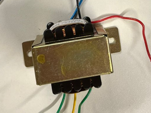

# Sistemas-embarcados
###  Funcionamento do retificador: 

Projeto desenvolvido em sala, aprendendo os conceitos básicos de sistemas embarcados e realizando e desenvolvido atividades para a melhor fixação do conteúdo.  Foi feito inicialmente uma simulação de um circuito de carregador de celular no sistema proteus. Após foi realizado a pratica da simulação inicial, colocando em pratica, com os componentes na protoboard. Enfim, fizemos um modelo 3d e pcb no proteus validando novamente como funciona todo esse circuito. 

Foi assim, por meio dessas atividades realizadas que compreendeu-se um pouco melhor sobre o funcionamento do retificador.
Conceitos basicos:

###### ⁎Retificador: 
Circuito que converte a corrente alternada em corrente continua;
###### ⁎Transformador:
 Usado para baixar ou aumentar a tensão elétrica por meio da indução elétrica. 
###### ⁎Bridge:
 que são os 4 diodos que temos no circuitos: Este são retificadores de  baixa potencia. Ou seja, são dispositivos semicondutores que basicamente atua como interruptor de um sentido para a corrente. É ele que deixa passar somente os "positivos " - osciloscopio  (ondas senoidales)
###### ⁎Capacitor: 
capacidade de armazena a carga eletrônica, diminui a tensão pico a pico - exemplo do fleche da camera 
###### ⁎Resistor :
Usado para limitar a corrente que flui pelo diodo. 

###### PCB: 
o pcb é a placa que colocamos os dispositivos interligados no proteus. Tem de fenolite (cobre)ou de Fibras de vidro; 

----Simulação realizada no proteus

----Prototipagem realizada em sala: 

----Placa PCB: 

---Modelo 3d: 

